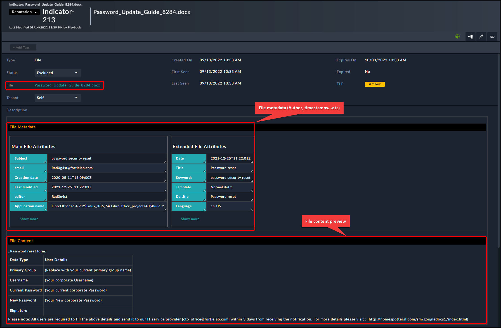

# Release Information

* **Version**: 1.2.0
* **Certified**: No
* **Authored By**: Parag Khatavkar & Mahdi Naili (Fortinet CSE)
* **Publisher**: Community
* **Compatible Version**: FortiSOAR v7.2.0 and above
* [Release Notes](./release_notes.md)
# Overview

Solution Pack examines Advisories sent by various organisations via email with attachments in PDF, Excel, CSV, and other formats. `File Metadata` and `File Content` is added to the record's Description. It notifies the count of IPs, Domain Name, Hashes, URLs, and so on if they are discovered via Email

# Next Steps

| [Installation](docs/setup.md#installation) | [Configuration](docs/setup.md#configuration) | [Usage](docs/usage.md) | [Contents](docs/contents.md) |
|--------------------------------------------|----------------------------------------------|------------------------|------------------------------|
