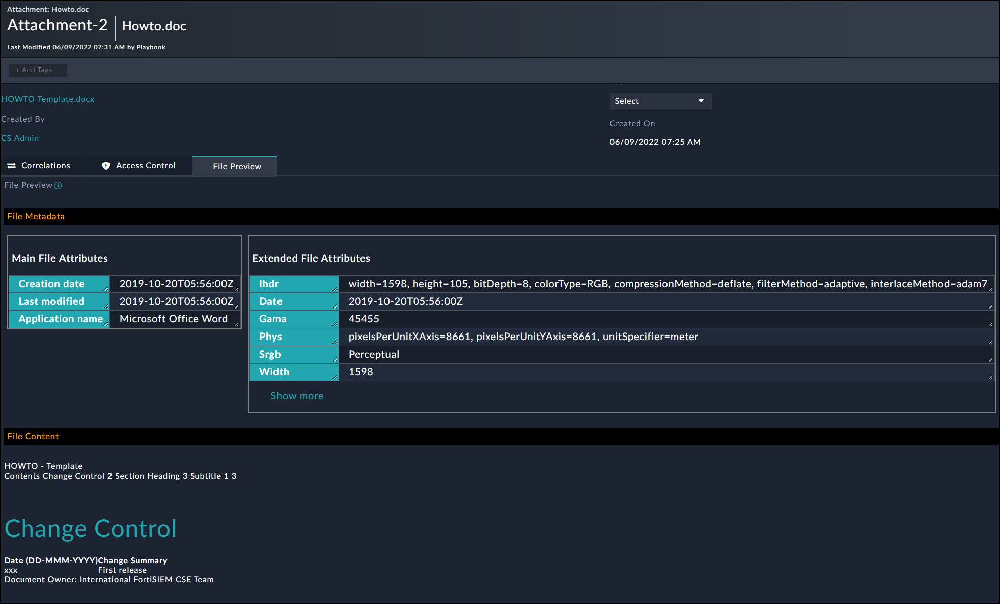

# File Content Extraction Solution Pack:

## Content:
### Schemas:
The Solution Pack adds **File Preview** HTML field for Indicators and Attachments modules.

### Playbooks:
#### 1) Extract and Process Text From Attachment File **Playbook**
With a manual trigger, you can use this playbook to extract:

- File Metadata
- File Content

The extracted data is then posted on the File Preview field, all extracted indicators from the file will be attached to the attachment record

#### 2) Extract and Process Text From Indicators File **Playbook**
Same as the attachment playbook except it operates on file based indicators as shown in the screenshot below:

