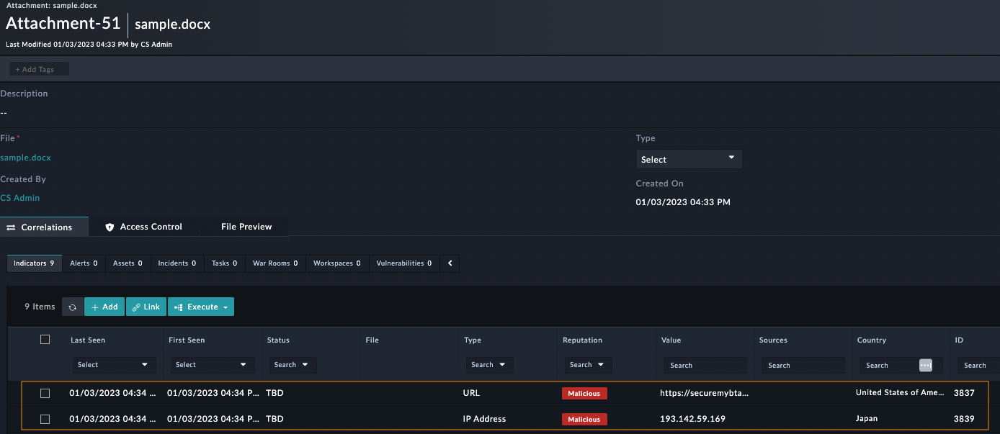
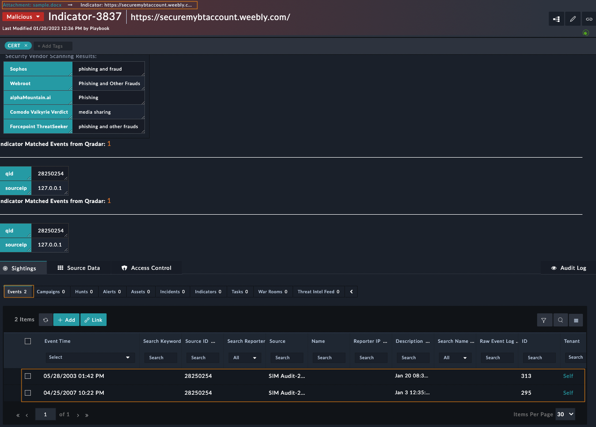

| [Home](../README.md) |
|----------------------|
# Usage

## Indicators extraction from files

Most Financial Institutes, Insurance Companies, Government departments, etc., receive advisories from Threat Intel Platforms (TIPs) and similar organizations containing indicators like IPs, domain names, file hash, and URLs. These advisories are generally delivered via email containing attachments in PDF, Excel, or CSV format. Also, the advisories are *defanged* so that the indicators in advisories cannot be used as a malicious links, for example:

- Brackets are added to domain names; for example, `www.example.com` is replaced with `www[.]example[.]com`
- Brackets are added to the IP address; for example, `8.8.8.8` is replaced with `8[.]8[.]8[.]8`
- Brackets are added to the URL; for example, `http://google.com` is replaced with `http[:]//google.com`

This solution pack can be triggered by creating a record for modules `Indicator` or `Attachment` for any type of file. Playbooks read the file and extract all the artifacts within the file - IP, hash, domains, URL, etc. Remove brackets from the artifacts 8[.]8[.]8[.]8 --> 8.8.8.8 and ingest advisories into FortiSOAR indicators module and run enrichment playbook. Users receive notifications containing the count of indicators found in the file by entering appropriate details in the **Configuration** step.

### Configuring the File Content Extraction Playbooks

By default, the `File Content Extraction` works with the configuration shown in the following image.

To make changes:
1. Navigate to **Automation** > **Playbooks**.
2. Click the **10 - SP - File Content Extraction** playbook collection.
3. For `Indicator` -> Double-click to open the **Extract and Process Text From Indicator File** playbook.
4. Double-click to open the *Configuration* step of **Extract and Process Text From Indicator File** playbook.
5. For `Attachment` -> Double-click to open the **Extract and Process Text From Attachment File** playbook.
6. Double-click to open the *Configuration* step of **Extract and Process Text From Attachment File** playbook.

| Variable Name       | Description                                                                                                                                                                                                                                                |
|:--------------------|:-----------------------------------------------------------------------------------------------------------------------------------------------------------------------------------------------------------------------------------------------------------|
| `send_mail`         | Mandatory field. Values can be `Enable` or `Disable`. To send mail, mark it as `Enable`, otherwise `Disable`. If left blank, it will not send the email.                                                                                                   |
| `send_to`           | Mandatory field if an email needs to be sent, otherwise Optional. Contains the email address of the intended recipients. To send emails to multiple users separate each email address with a comma. For example, `noreply@example.com`, `demo@example.com` |
| `send_from`         | Optional field. Contains the sender's email address. It accepts only one email address from which the recipients receive the email. For example, `noreply@example.com`                                                                                     |
| `email_integration` | Optional Field. Values can be `SMTP` or `Exchange`. It is the email server type that is used for sending the email to the specified email recipients. If left blank, it uses the `SMTP` email server type.                                                 |
### Sample Email Notification
The following image shows an example notification email and count of IOCs:

|  |  |
|:------------------------:|:-------------------------:|
|        Indicator         |        Attachment         |

## Hunt Indicator On SIEM

Refer to the scenario below to hunt an indicator on SIEM and obtain the events matching their values. This is part of lateral movement detection, a potential use of the returned event is to quarantine the associated assets and prepare them for recovery tasks.

**To run it in demo mode:**
1. Set global variable *Demo Mode* as true.
2. Open an Attachment record with a file containing indicators (pdf, MS office format...etc)
3. Execute the `Extract and Hunt Indicators on SIEM` playbook over the attachment record `Sample File`.
4. Extracted indicators are linked to the attachment file

5. Each matching event on SIEM will be saved and linked to the associated indicator

6. The playbook will try to look up the md5 value for all SHAx (1/256) indicators. If found the MD5 indicator will be created and linked to the associated SHAx one.

**For Production:**
1. Set global variable *Demo Mode* as false.
2. Adapt the playbooks to your environment

