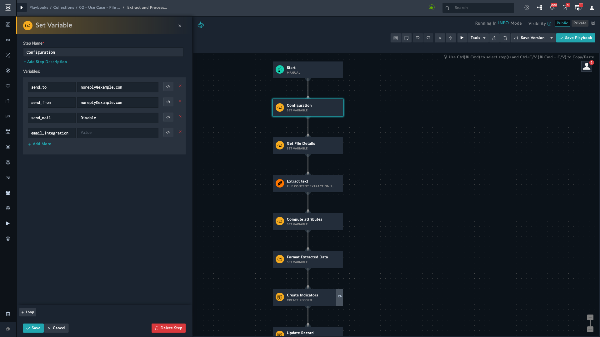
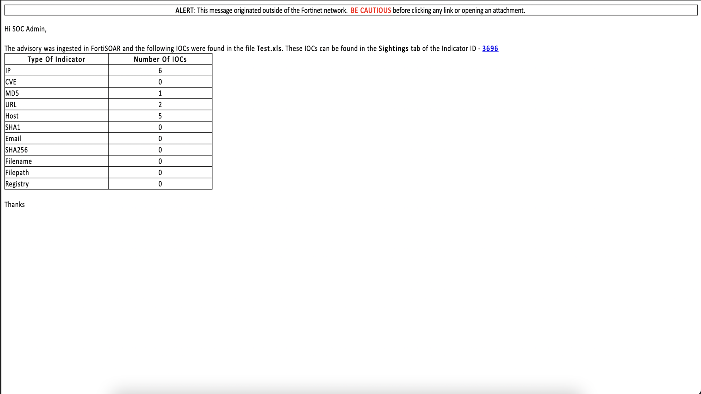
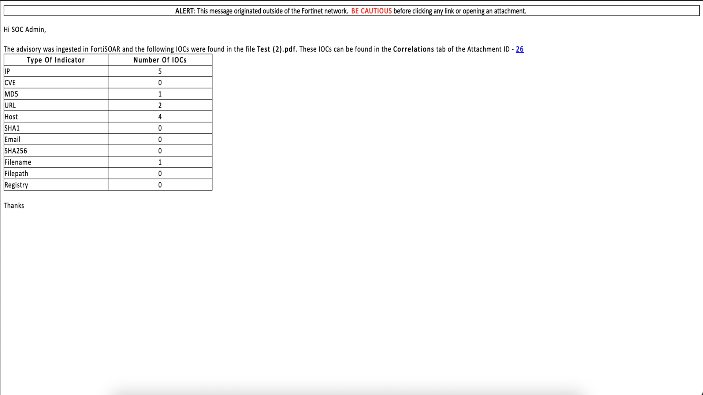

| [Home](https://github.com/fortinet-fortisoar/solution-pack-file-content-extraction/blob/release/1.1.0/README.md) |
|--------------------------------------------|

# Usage

Most of the Financial Institutes, Insurance Companies, Government departments, etc receive advisories from TIPs and various organisations.  Most advisories contain - IPs, Domain names, Hash, URL, etc. Advisories are generally delivered via email having attachments in PDF, Excel or CSV format. Also the advisories would be defanged example:

>* Brackets are added to domain names; for example, `www.example.com` is replaced with `www[.]example[.]com`
>* Brackets are added to the IP address; for example, `8.8.8.8` is replaced with `8[.]8[.]8[.]8`
>* Brackets are added to the Url; for example, `http://google.com` is replaced with `http[:]//google.com`

This solution pack can be simulated `Manually` on creation of record for modules `Indicator` or `Attachment` for any type of the file. Playbooks read the file and extract all the artifacts within the file - IP, hash, domains, URL, etc. Refang the artifacts 8[.]8[.]8[.]8 --> 8.8.8.8 and Ingest advisories into FortiSOAR indicators module and run enrichment playbook. User get notifiy for the count of IOCs found in file. To get notified for IOCs count via email user need to configure Configuration step.

## Configuring the File Content Extraction Playbooks

By default, the File Content Extraction works with the configuration shown in the following image.

To make changes:
1. Navigate to **Automation** > **Playbooks**.
2. Click the **10 - SP - File Content Extraction** playbook collection.
3. For `Indicator` -> Double-click to open the **Extract and Process Text From Indicator File** playbook.
4. Double-click to open the *Configuration* step of **Extract and Process Text From Indicator File** playbook.
5. For `Attatchment` -> Double-click to open the **Extract and Process Text From Attachment File** playbook.
6. Double-click to open the *Configuration* step of **Extract and Process Text From Attachment File** playbook.

| Variable Name         | Description                                                                                                                                                                              |
|:-------------------|:-----------------------------------------------------------------------------------------------------------------------------------------------------------------------------------------|
| `send_mail` | Mandatory field. Values can be `Enable` or `Disable`. To send mail, mark it as `Enable`, otherwise `Disable`. If left blank, it will not send email.|
| `send_to` | Mandatory field if email need to be send, otherwise Optional. Contains the email address of the intended recipients. To send emails to multiple users separate each email address with a comma. For example, `noreply@example.com`, `demo@example.com` |
| `send_from` | Optional field. Contains the sender's email address. It accepts only one email address from which the recipients receive the email. For example, `noreply@example.com` |
| `email_integration` | Optional Field. Values can be `SMTP` or `Exchange`. It is the email server type that is used for sending the email to the specified email recipients. If left blank, it uses the `SMTP` email server type. |

## Sample Email Notification
The following image shows an example notification email, count of IOCs:

|     |     |
|:------------------------------------------:|:------------------------------------------:|
| Indicator | Attachment |